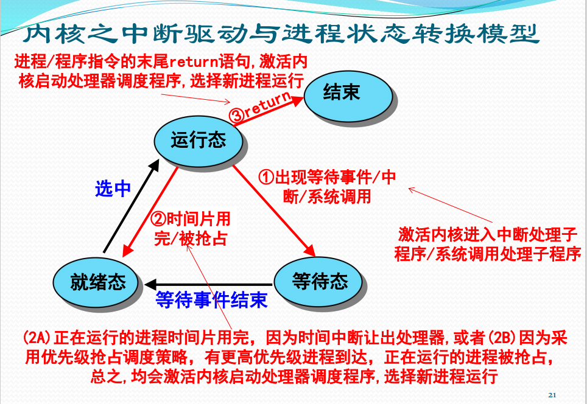

# Ch02处理器管理

## 处理器

### 处理器的组成部件
寄存器
- 用户程序可见寄存器
- 控制与状态寄存器

*程序状态字PSW: 既是操作系统的概念, 指记录当前程序运行的动态信息, 也是计算机系统的寄存器*

算术逻辑单元

### 指令与处理器模式
机器指令是计算机系统执行的基本命令, 是CPU执行的基本单位

指令的执行过程
1. 取指: CPU根据PC取出指令, 放入IR
2. 译码: 对IR中的指令进行解译, 来决定其执行行为
3. 执行: 连接到CPU部件执行计算, 产生结果并写回

指令可以按流水线一样进行执行

- 特权指令: 核心资源相关的指令, 只能被操作系统程序使用
- 非特权指令: 能够被所有程序使用的指令

处理器模式

为什么需要处理器模式: 实现特权指令的管理

一般设置0, 1, 2, 3四种运行模式
- 0 OS内核
- 1 系统调用
- 2 共享库程序
- 3 用户程序
一般来说现代OS只使用0和3两种模式, 分别对应于内核模式和用户模式

如何实现处理器模式的切换
- 中断, 异常或系统异常, 触发用户模式 -> 内核模式
- OS内核处理完成, 调用中断返回指令, 触发内核模式 -> 用户模式

## 中断管理

### 中断
什么是中断: 中断是值程序执行过程中, 遇到急需处理事件时, 暂时终止CPU上现行程序, 转去执行相应的事件处理程序, 处理完成后再返回的过程

**操作系统是中断驱动的**, 换言之中断是激活操作系统的唯一方式 (广义的中断)

- 狭义的中断指来源于处理器外的中断事件, 即与当前运行指令无关的中断事件(也就是排除了系统调用)

- 异常指运行指令引起的中断事件 *如地址异常, 算术异常, 处理器硬件故障等*

- 系统异常指执行陷入指令而触发系统调用引起的中断事件 *如请求设备, 请求I/O, 创建进程等*

### 中断源
中断的来源
1. 处理器硬件故障中断事件
2. 程序性中断事件
3. 自愿性中断事件, 也就是系统调用
4. I/O中断事件, 来源于外围设备, 用于报告I/O状态的中断事件
5. 外部中断事件, 由外围设备发出的信号引起的中断事件

中断可分为同步中断和异步中断
- 同步中断: 指令执行时由CPU控制单元发生, 只有在一条指令执行完毕后才会发出中断, 如系统调用
- 异步中断: 由其他硬件设备按照CPU时钟信号随机产生, 意味着中断能够在指令之间发生, 如键盘中断
- 同步中断称为异常, 异步中断称为中断

异常可以分为故障, 陷阱, 终止三类, 其中陷阱是有意的异常(系统调用), 而其他的是处理器硬件故障的中断

### 中断系统
中断系统是计算机系统中响应和处理中断的系统, 包括硬件子系统和软件子系统
- 硬件子系统: 完成中断响应
- 软件子系统: 完成中断处理
**充分体现了软硬件协同设计**

处理器如何响应中断
- 在指令执行周期最后增加一个微操作, 以响应中断

中断装置: 计算机系统中发现并相应中断/异常的装置

由于中断源多种多样, 硬件实现的中断装置也有多种, 分别处理不同类型的中断
- 处理器外的中断: 由中断控制器发现和响应
- 处理器内的异常: 由指令的控制逻辑和实现线路发现和响应, 相应机制称为陷阱
- 请求OS服务的系统异常: 处理器执行陷入指令时直接触发, 相应机制称为系统陷阱

#### 中断控制器
是CPU中的一个控制部件, 包扩中断控制逻辑线路和中断寄存器
- 外部设备发出中断请求IRQ, 在中断寄存器中设置已发生的中断
- 每一条指令处理结束前, 都会检查一下中断寄存器, 若有**不被屏蔽**的中断产生, 则改变CPU操作顺序, 进行中断处理
- 通过查询中断向量表来获知中断处理程序的首地址

#### 陷阱与系统陷阱
是指令的控制逻辑和实现线路的一部分
- 执行指令出现异常后, 会根据异常情况转向操作系统的异常处理程序
- 虚拟地址异常后, 需要重新执行指令, 往往越过陷阱, 设置页面异常处理程序
- 若执行的指令就是陷入指令, 则会越过陷阱处理, 触发系统陷阱, 激活**系统调用**处理程序

中断的响应过程
1. 发现中断源, 提出中断请求
   1. 发现中断寄存器中记录的中断
   2. 决定这些中断是否应该屏蔽
   3. 当有多个要响应的中断源时, 根据优先级选择
2. 中断当前程序的执行
   1. 保存当前程序的PSW和PC到核心栈
3. 转向操作系统的中断处理程序
#### 中断处理程序
OS处理中断事件的控制程序, 主要任务是处理中断事件和恢复正常操作

中断处理过程
1. 保护未被硬件保护的处理器状态
2. 通过分析被中断进程的PSW中段码字段, 识别中断源
3. 分别处理发生的中断事件
   1. 查中断向量表, 执行中断处理子程序
4. 恢复正常操作
   1. 情况1: 直接返回刚刚被中断的进程
   2. 情况2: 中断当前进程的运行, 调整进程队列, 启动进程调度, 选择下一个执行的进程并恢复执行

### 多中断的响应与处理
首先是中断屏蔽, 中断装置通过中断屏蔽位决定是否响应已发生的中断, 实现有选择的响应中断

若有多个中断都被允许, 这时候就需要根据中断的优先级来确定中断装置响应中断的顺序

中断的嵌套处理

当计算机响应中断后, 在中断处理过程中, 可以再响应其他中断

*考虑到效率和实现代价, 中断的嵌套处理层数不能过深*

**中断的嵌套处理会改变中断处理次序, 先响应的有可能后处理**

## 进程管理
### 进程及其状态
为什么要有进程
- 操作系统必须全方位地管理计算机系统中运行的程序
- 为正在运行的程序建立的一个管理实体

进程的概念
- 进程是一个具有一定独立功能的程序关于某个数据集合的一次运行活动
- 进程是操作系统进行资源分配和处理器调度的一个独立单位

一个进程包括五个实体部分
1. OS管理运行程序的数据结构P
2. 运行程序的内存代码C
3. 运行程序的内存数据D
4. 运行程序的通用寄存器信息R
5. OS控制程序执行的程序状态字信息PSW

不同程序在不同数据集上运行, 构成无关进程

不同程序在相同数据集上运行, 构成共享数据的交往进程

相同程序在不同数据集上运行, 构成共享代码的无关进程

*共享的代码称为可再入程序, 如编辑器, 可再入程序是纯代码的*

**注意以上说的代码和数据都是位于内存中的, 也就是说每次运行同一个外存程序, 都会构成不同的进程**

#### 进程状态
分为
1. 运行态: 指进程占有处理器运行
2. 就绪态: 指进程具备运行条件, 等待处理器运行
3. 等待态: 指进程由于等待资源, 输入输出, 信号等而不具备运行条件. 也称为阻塞态

进程的三态模型

1. 运行态 -> 等待态: 等待资源, I/O, 信号
2. 等待态 -> 就绪态: 资源满足, I/O结束, 信号完成
3. 就绪态 -> 运行态: 处理器空闲时选择, 更高优先级进程抢占
4. 运行态 -> 就绪态: 运行时间片到, 有更高优先级进程

进程挂起的概念
- OS无法预期进程的数目与资源需求, 在运行过程中可能出现资源不足的情况
- 解决: 剥夺某些进程的内存及其他资源, 调入OS管理的对换区, 不参加进程调度, 这就是进程挂起
- **挂起态与等待态有本质区别**

进程挂起的选择与恢复

- 一般选择等待态进程进入挂起等待态
- 也可以选择就绪态或运行态进入挂起就绪态
- 挂起等待态在等待事件结束后会进入挂起就绪态
- 恢复一般选择挂起就绪态

### 进程的数据描述
#### 进程控制块(Process Control Block)PCB
是OS用于记录和刻画进程状态及环境信息的数据结构

借助PCB, OS可以全面管理进程的物理实体, 刻画进程的执行现状, 控制进程的执行, PCB包括
1. 标识信息: 用于存放唯一标识该进程的信息
2. 现场信息: 用于存放该进程运行时的处理器现场信息 *各种寄存器的内容*
3. 控制信息: 用于存放与管理、调度进程相关的信息

#### 进程映像(Process Image)
某一时刻进程的内容及其执行状态集合

包括
1. PCB
2. 进程程序块
3. 进程数据块
4. 核心栈: 进程在内核模式下运行时使用的堆栈, 用于中断或系统调用使用

进程映像是内存级的物理实体, 又称为进程的内存映像

#### 进程上下文(Process context)
进程的执行需要环境支持, 包括CPU现场和Cache中的执行信息

OS中的进程物理实体和支持进程运行的环境合成进程上下文, 包括
1. 用户级上下文: 用户程序块, 用户数据区, 用户栈, 用户共享内存
2. 寄存器上下文: PSW, 栈指针, 通用寄存器
3. 系统级上下文: PCB, 内存区表, 核心栈

**进程上下文刻画了进程的执行情况**

### 进程管理的实现
关键的进程管理软件包括
1. 系统调用/中断/异常处理程序
2. 队列管理模块
3. 进程控制程序
4. 进程调度程序
5. 进程通信程序
6. 终端登录与作业控制程序, 性能监控程序, 审计程序等外围程序

#### 队列管理模块
是OS实现进程管理的核心模块

OS建立多个进程队列, 包括就绪队列和等待队列

按需组织为先进先出队列与优先级队列

队列中的进程通过PCB中的队列指引元连接

进程与资源调度围绕进程队列展开

#### 原语
进程控制过程中设计对OS核心数据结构的修改, 为防止与时间有关的错误, 应使用原语

**原语是由若干条指令构成的完成某种特定功能的程序, 执行上具有不可分割性**

进程控制原语:
1. 进程创建
2. 进程撤销
3. 进程阻塞
4. 进程唤醒
5. 进程挂起
6. 进程激活

另一类常用原语是进程通信原语

### 进程切换
指从正在运行的进程中收回处理器, 让待运行进程来占有处理器运行

实质上就是被中断运行进程与待运行进程的上下文切换
1. 保存被中断进程的上下文
2. 转向进程调度
3. 恢复待运行进程的上下文

进程切换必须在操作系统内核模式下完成, 因为进程的上下文保存涉及系统级上下文, 这就需要模式切换

模式切换的具体工作流程
1. 中断装置完成正向模式切换
   1. 处理器模式转为内核模式
   2. 保存当前进程的PC/PSW到核心栈
   3. 转向中断/异常/系统调用处理程序
2. 中断返回指令完成逆向模式切换
   1. 从待运行进程核心栈中弹出PSW/PC
   2. 处理器模式转为用户模式

进程切换的具体工作流程
1. (中断/异常等触发)正向模式切换并压入PSW/PC
2. 保存被中断进程的现场信息
3. 处理具体中断/异常
4. 把被中断进程的系统堆栈指针SP保存到PCB
5. 调整被中断进程的PCB
6. 把被中断进程的PCB加入相关队列
7. 选择下一个占用CPU的进程
8. 修改被选中的PCB信息
9. 设置被选中进程的地址空间, 恢复存储管理信息
10. 恢复被选中进程的SP到处理器寄存器
11. 恢复被选中进程的现场信息进入处理器
12. (中断返回指令触发)逆向模式转换并弹出PSW/PC

进程切换一定发生在中断/异常/系统调用处理过程, 但不是所有的中断/异常/系统调用都会引起进程切换
## 多线程技术
### 多线程环境概述
传统进程是单线程结构进程, 在并发程序设计上存在问题
- 进程切换开销大
- 进程通信开销大
- 限制了进程并发的粒度(进程内无法并发)
- 降低了并行计算的效率(只有一个执行流)

解决思路
- 把进程的两项功能, "独立分配资源", 与"被调度分派执行" 分离

进程作为系统资源分配和保护的独立单位

线程作为系统调度和分派的基本单位

多线程环境下的进程概念: 是OS进行保护和资源分配的独立单位

多线程环境下的线程概念: 线程是进程的一条执行路径, 是调度的基本单位, 同一个进程中的所有线程共享进程获得的主存和资源

线程状态有: 运行, 就绪和睡眠

**挂起是和资源相关的, 应该是属于进程的状态**

相关的线程操作有: 孵化, 封锁, 活化, 剥夺, 指派, 结束

并发多线程程序设计的优点
- 快速线程切换
- 减少管理开销
- 线程间通信易于实现
- 并行程度提高
- 节省内存空间

### KLT与ULT

#### 内核级线程KLT
线程管理的所有工作由OS内核来做

OS提供一个应用程序设计接口, 供开发者使用KLT

特点
1. 进程中的一个线程被阻塞, 内核能调度同一进程的其他线程占用处理器运行
2. 多处理器环境中, 内核能同时调度同一进程中多个线程并行执行
3. 内核自身也可用多线程技术实现
4. 应用程序线程在用户态运行, 线程调度和管理在内核实现, 线程的切换需要模式切换, 系统开销较大

#### 用户级线程ULT
用户空间运行的线程库, 提供多线程应用程序的开发和运行环境

任何应用程序均需通过线程库进行程序设计, 再与线程库连接后运行

线程管理的所有工作都由应用程序完成, 内核没有意识到线程的存在

特点
1. 线程切换不需要模式切换
2. 允许进程按应用特定需要选择调度算法
3. 能运行在任何OS上, 内核在支持ULT方面不需要做任何工作
4. 不能利用多处理器的优点, OS调度进程, 仅有一个ULT能执行
5. 一个ULT的阻塞, 将引起整个进程的阻塞

Jacketing技术

把阻塞式系统调用改造成非阻塞式的

当线程陷入系统调用时, 执行Jacketing程序

由Jackting程序来检查资源使用情况, 以决定是否执行进程切换或传递控制权给另一个线程

**ULT适用于解决逻辑并行性问题**
**KLT适用于解决物理并行性问题**

### 多线程实现的混合策略
线程创建是完全在用户空间做的, 单应用的多个ULT可以映射成一些KLT, 通过调整KLT数目达到较好的并行效果

特点
1. 组合用户级线程和内核级线程设施
2. 线程创建完全在用户空间完成, 线程的调度和同步也在应用程序中进行
3. 一个应用中的多个用户级线程被映射到一些内核级线程上
4. 程序员可以针对特定应用和机器调节内核级线程的数目, 以达到整体最佳效果

多线程混合策略下的线程状态

- KLT三态由系统调度负责
- ULT三态由用户调度负责
- 活跃态的ULT代表绑定KLT的三态
- 活跃态ULT运行时可激活用户调度
- 对于非阻塞的系统调用, 可使用Jacketing启动用户调度, 由Jacketing来调整活跃态ULT

## 处理器调度

### 处理器调度的层次
分为
1. 高级调度: 又称长程调度, 作业调度, 决定能否加入到执行的进程池中, **新建态转为就绪态还是就绪挂起态**
2. 中级调度: 又称平衡负载调度, 决定主存中的可用进程集合, **是否要挂起**
3. 低级调度: 又称短程调度, 进程调度, 决定哪个可用进程占用处理器执行, **是否能从就绪态转为运行态**

低级调度: 又称处理器调度, 按照某种原则把处理器分派给就绪态进程或内核级线程

这种原则就是进程调度程序, 又称分派程序, 是OS的最核心的部分

处理器调度策略的优劣直接影响到整个系统的性能

低级调度的主要功能
- 记住进程或内核级线程的状态
- 决定某个进程或内核级线程什么时候获得处理器, 以及占用多长时间
- 把处理器分派给进程或内核级线程
- 收回处理器

### 处理器调度算法
选择处理器调度算法的原则
- 资源利用率
- 响应时间
- 周转时间: 提交到执行完成的时间
- 吞吐量: 单位时间处理的进程数
- 公平性

#### 优先数调度算法
根据分派给进程的优先数决定下一个运行进程, 这类的算法包括
1. 抢占式优先数调度算法
2. 非抢占式优先数调度算法

优先数的确定准则
- 进程负担任务的紧迫程度
- 进程的交互性
- 进程使用外设的频度
- 进程使用处理器的服务时间长短

所谓非抢占式调度, 即不会有运行态->就绪态跳转, 若一个进程出现了死循环就会一直占用着处理器

与使用处理器服务时间长短相关的优先数
1. 计算时间短优先(最短进程优先)
2. 剩余计算时间短优先(最短剩余时间优先)
3. 相应比高优先 $响应比 = \frac{等待时间 + 预期处理器的服务时间}{预期处理器的服务时间}$
4. 先来先服务: 多用于高级调度, 在低级调度中以计算为主的进程过于优越

#### 时间片轮转调度算法(Round Robin)
根据各个进程进入就绪队列的时间先后轮流占用CPU一个时间片

时间片长度的确定: 选择长短合适的时间片, 过长则退化为先来先服务, 过短则调度开销大

基于时钟做抢占式调度

以一个周期性间隔产生时钟中断, 当中断发生时, 当前正在运行的进程被置于就绪队列中, 然后基于先来先服务策略选择下一个就绪进程运行

#### 分级调度算法(feedback)
又称多队列策略, 反馈循环队列, 多级反馈队列调度算法

基本思想
- 建立多个不同优先级的就绪进程队列
- 就绪进程队列间按照优先数调度
- 高优先级就绪进程分派的时间片短, 因为高优先级队列里的进程都很重要, 要频繁切换执行
- 在同一个就绪进程队列中的进程优先数和时间片是相同的

分级原则参考优先数的确定

现代OS的分级调度算法
- 多个高优先级的实时进程队列
- 多个分时任务的进程队列

一种分级调度算法:
- 当一个进程第一次进入系统时, 被放置在RQ0(最高优先级的队列)
- 当它第一次被抢占后并返回就绪状态时, 被放置在RQ1(惩罚降低一个优先级)
- 一个短进程很快会被执行万没不会被降过多级

#### 彩票调度算法
基本思想: 为进程发放针对系统各种资源的彩票, 当调度程序需要做出决策时, 随机选择一张彩票, 持有该彩票的进程将获得系统资源

传统Unix系统的调度
- 多级反馈队列, 每个优先级队列使用时间片轮转
- 每秒重新计算每个进程的优先级
- 给每个进程赋予基本优先级, 目的是把所有进程划分成固定的优先级区
- 可控调节因子

Windows调度算法
- 基于内核级线程的可抢占式调度, 向单个用户提供交互式的计算环境, 并支持各种服务器程序
- 分为实时优先级层次和可变优先级层次
  - 实时优先级层次: 用于通信任务和实时任务, 优先数不可变
  - 可变优先级层次: 用于用户提交的交互式任务, 优先数可动态调整
- 同样采用多级反馈队列
- 优先数可动态调整原则
  - 线程所属的进程对象有一个进程基本优先数, (0 ~ 15)
  - 线程对象有一个线程基本优先数 (-2 ~ 2)
  - 线程的初始优先数为进程基本优先数加上线程基本优先数, 但必须在 (0 ~ 15)
  - 线程的动态优先数必须在初始优先数到15的范围内
- 当存在N个处理器时, N-1个处理器上将运行N-1个最高优先级的线程, 其他线程将共享剩下的一个处理器